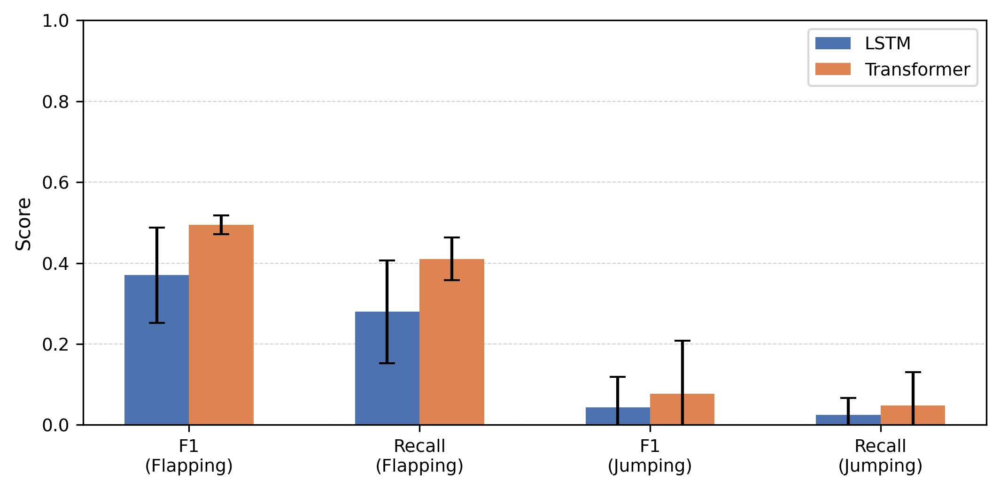
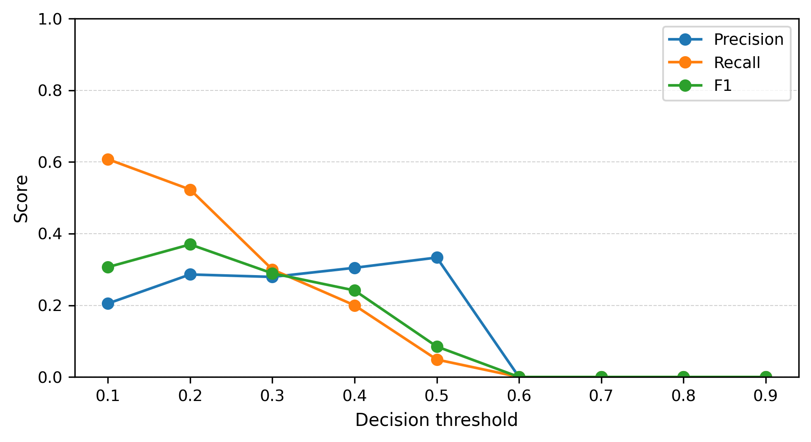

# Pose Behavior Transformer

Reproducible benchmark for pose-based sequence modeling of stereotyped motor behaviors in clinical autism video data.

## Overview

This repository provides a reproducible machine learning pipeline for detecting stereotyped motor behaviors from pose sequences extracted from clinical video recordings.

The study compares two sequence modeling approaches:

- Long Short-Term Memory (LSTM)
- Transformer encoder

Both models are evaluated under subject-independent cross-validation to reflect real-world clinical deployment scenarios.

---

## Task

- **Input**: sequences of 2D pose keypoints (OpenPose)
- **Output**: multi-label classification

Labels:
- flapping
- jumping

Each sample consists of a fixed-length sequence of **15 frames**.

---

## Key Characteristics

- Multi-label classification
- Strong class imbalance
- Rare event detection (especially jumping)
- Subject-independent evaluation (StratifiedGroupKFold)

---

## Data

The repository includes a preprocessed sequence-level dataset:

data/sequence_data.npz

Contents:

- X_sequences: shape (N, 15, F)
- y_sequences: shape (N, 2)
- groups_sequences: subject identifiers

Notes:
- Original video data are not included due to privacy constraints
- The dataset contains no personally identifiable information

---

## Repository Structure

```text
src/
  data/
  models/
  training/
  evaluation/

data/
  sequence_data.npz

reports/
  figures and tables used in the paper
```

## Reproducibility

### Install dependencies

```bash
pip install -r requirements.txt
```

### Train models

```bash
python -m src.training.train_lstm
python -m src.training.train_transformer
```

### Evaluate results

```bash
python -m src.evaluation.compute_paper_tables
python -m src.evaluation.plot_paper_results
python -m src.evaluation.plot_confusion_matrix
python -m src.evaluation.threshold_analysis
```

## Evaluation Protocol
- 3-fold StratifiedGroupKFold
- Grouping by subject
- Multi-label stratification
- No subject overlap between training and test sets
- Preprocessing performed within training folds to avoid data leakage

## Results (Summary)

| Model       | F1 flap | Recall flap | F1 jump | Recall jump |
|-------------|---------|-------------|---------|-------------|
| LSTM        | 0.37    | 0.28        | 0.04    | 0.02        |
| Transformer | 0.49    | 0.41        | 0.08    | 0.05        |



## Key observations:

- Transformer improves performance for flapping
- Both models perform poorly on jumping
- High variability across folds for rare behaviors

## Threshold Analysis

Lowering the decision threshold increases recall for jumping substantially, while precision remains relatively stable at intermediate thresholds.

This indicates that the models capture relevant signal but are not well calibrated for rare behaviors at default thresholds.



## Limitations

- Limited subject-level representation for rare behaviors
- Upper-body pose features only
- Short temporal context (15 frames)
- Strong class imbalance

## Related Work

Lemler et al. (2025). *Semi-Automated Multi-Label Classification of Autistic Mannerisms by Machine Learning on Post Hoc Skeletal Pose Data*. Autism Research.
https://onlinelibrary.wiley.com/doi/10.1002/aur.70020

## License

See [LICENSE](LICENSE).