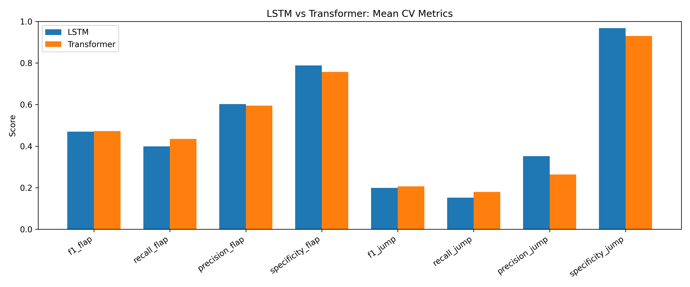
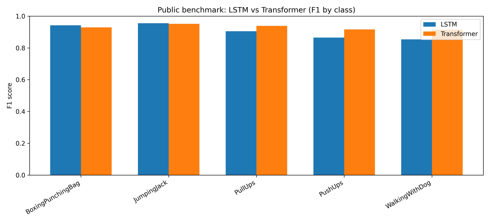
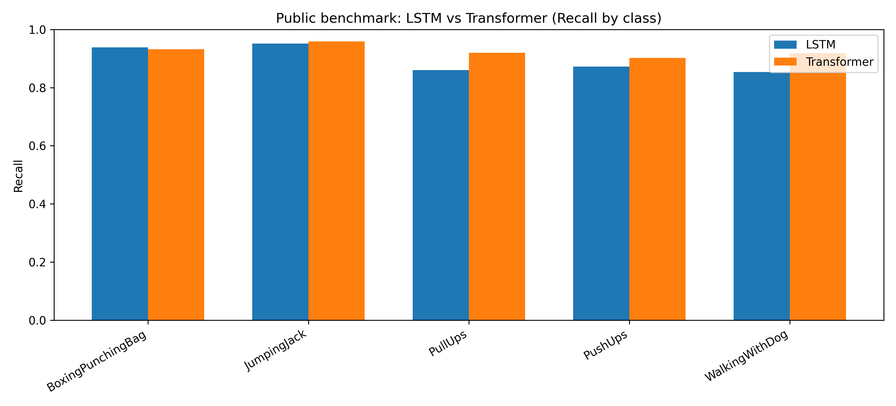

# Pose Behavior Transformer

A modular benchmark for temporal behavior recognition using sequence models.

This repository implements a reproducible machine learning pipeline for temporal behavior recognition from pose sequences and video data. The project focuses on comparing LSTM and Transformer architectures under subject-independent evaluation conditions across both private and public datasets.

## Motivation

Manual behavioral coding is time-consuming and difficult to scale.  
This project investigates whether sequence models can support or partially automate behavioral annotation from video-derived signals.

In addition, the repository is designed as a modular benchmark framework that enables consistent comparison of sequence models across different data modalities.

## Task

- Input: sequences of pose keypoints (OpenPose)
- Output: multi-label classification of motor behaviors

Labels:
- flapping
- jumping

## Pipeline overview

The repository currently supports two complementary data pipelines:

### 1. Pose-based pipeline (private dataset)
- Input: OpenPose keypoints
- Task: multi-label classification (flapping, jumping)
- Domain: clinical behavioral coding

### 2. Video-based pipeline (public dataset)
- Input: raw video frames (UCF101 subset)
- Task: multi-class action recognition
- Domain: general human activity recognition

Both pipelines share:
- identical sequence modeling architectures (LSTM, Transformer)
- consistent evaluation via StratifiedGroupKFold
- comparable metrics across tasks

## Method

Shared design choices:
- sequence length: 15 frames
- LSTM and Transformer sequence models
- subject-independent evaluation via StratifiedGroupKFold

Private pose-based benchmark:
- feature representation: 2D keypoints
- multi-label classification (sigmoid outputs)
- strong class imbalance handled via undersampling

Public video-based benchmark:
- frame-based grayscale features
- multi-class classification (one-hot encoding)

## Models

- LSTM baseline (multi-layer)
- Transformer encoder (multi-head attention)

## Evaluation

- subject-independent splitting using StratifiedGroupKFold
- 3-fold cross-validation
- metrics:
  - precision
  - recall
  - F1-score
  - specificity
- evaluation performed per label

## Results

| Model       | F1 flap | Recall flap | F1 jump | Recall jump |
|-------------|---------|-------------|---------|-------------|
| LSTM        | 0.4692  | 0.3989      | 0.1985  | 0.1522      |
| Transformer | 0.4727  | 0.4344      | 0.2065  | 0.1794      |

### Interpretation

- Transformer slightly improves recall and F1 across both labels
- Jump behavior remains substantially harder to detect
- Results indicate potential benefits of attention-based models for temporal pose data

## Repository structure

```text
src/
  data/
    loader.py
    preprocessing.py
    prepare_data.py
    public_video_loader.py
    prepare_public_data.py
  models/
    lstm_model.py
    transformer_model.py
  training/
    train_lstm.py
    train_transformer.py
    train_lstm_public.py
    train_transformer_public.py
    cross_validation.py
  evaluation/
    metrics.py
    plot_model_comparison.py
    plot_training_curves.py
    plot_public_model_comparison.py
```

## Data

The private dataset originates from clinical behavioral coding and is not publicly available due to privacy constraints.

To run the private benchmark:

1. Place your dataset in:

```text
local_data/df_cleaned.csv
```

2. Prepare sequences:

```bash
python -m src.data.prepare_data
```

3. Train models:

```bash
python -m src.training.train_lstm
python -m src.training.train_transformer
```

### Public data

To run the public benchmark:

1. Place videos in:

```text
local_data/public_videos/
  class_name/
    video1.avi
```

2. Prepare sequences:

```bash
python -m src.data.prepare_public_data
```

3. Train models:

```bash
python -m src.training.train_lstm_public
python -m src.training.train_transformer_public
```

## Requirements

```bash
pip install -r requirements.txt
```

## Visualizations

Training curves and model comparison plots can be generated with:

```bash
python -m src.evaluation.plot_model_comparison
python -m src.evaluation.plot_training_curves
```

## Model comparison



## Public benchmark: UCF101 subset

To validate generalization beyond the clinical setting, we evaluate the models on a subset of the UCF101 action recognition dataset.

Selected classes:
- BoxingPunchingBag
- JumpingJack
- PullUps
- PushUps
- WalkingWithDog

Setup:
- sequence length: 15 frames
- frame-based features (64×64 grayscale)
- multi-class classification (one-hot encoding)
- subject-independent splitting via group-based cross-validation

### Results on public demo dataset (UCF101 subset)

The Transformer model achieves consistently strong performance across all classes, with slight improvements over the LSTM baseline for most actions.

The LSTM performs competitively on highly repetitive motion patterns, while the Transformer shows advantages for more complex temporal dynamics.

These results support the hypothesis that attention-based models can better capture temporal dependencies in video sequences.

### Model comparison





## Status

This repository currently includes a private pose-based benchmark and a public video-based benchmark, and will be extended with additional datasets and model variants.